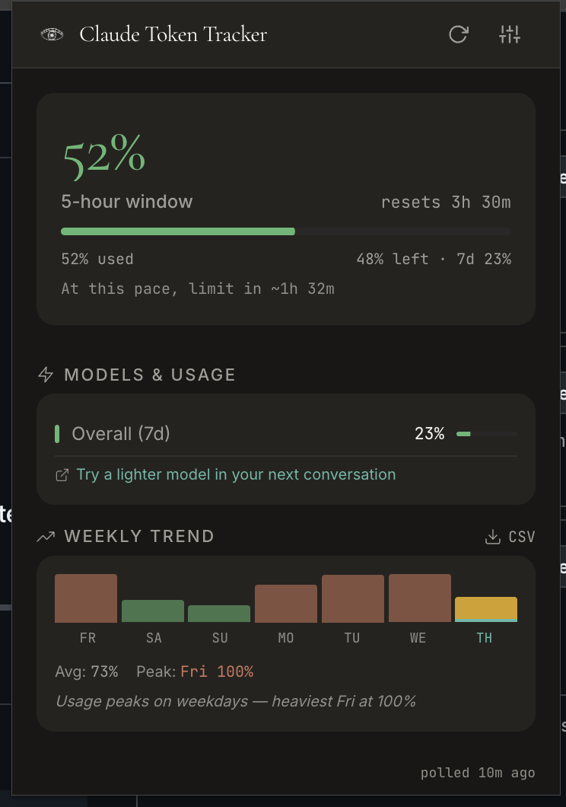

# tt — Claude Usage in Your Terminal

**Live Claude quota in your terminal, status bar, and browser badge — before you hit the wall.**

You're deep in a Claude Code session, everything's clicking — and then it just stops. Rate limited. You had no warning, no countdown, no idea you were even close.

`tt` is a small toolkit that surfaces your Claude usage in real time, everywhere you work. A Chrome extension polls claude.ai every five minutes and pushes your quota data to a local file on your machine. From there, a CLI command gives you an instant snapshot in your terminal, and a status line script plants that same data right at the bottom of every Claude Code session. You always know where you stand — 44% used, 3h 56m until reset — without ever leaving your flow to check a dashboard.



---

## What it is

Three pieces that work together:

| Piece | What it does |
|---|---|
| **Chrome extension** | Polls claude.ai every 5 min, shows quota % as a browser badge |
| **`tt` CLI** | Reads cached usage data, prints quota + reset time in your terminal |
| **Status line script** | Runs inside Claude Code — live usage at the bottom of every session |

The extension is the source of truth for your claude.ai quota. A small local server bridges browser to filesystem so the CLI can read it.

---

## What it looks like

**In your terminal:**

```
claude.ai   44% ████░░░░░░ │ resets 3h 56m
claude code 655.2K tokens  │ 67 msgs │ 5h window │ Sonnet
```

**At the bottom of Claude Code:**

```
 44% ████░░░░░░ │ resets 3h 56m │ 655K (67 msgs)
```

**On your browser tab:** a green badge that turns amber at 70% and red at 90%.

---

## How it works

Your browser can't write files directly — that's just how the Chrome sandbox works. So there's a tiny bridge server that sits in the middle:

```
claude.ai (logged in)
      │  fetch() every 5 min
      ▼
background.js (service worker)
      │  POST JSON
      ▼
tt-server.js  (:9898)
      │  writes
      ▼
~/.token-tracker/usage.json
      │
      ├──► tt             (CLI — reads on demand)
      └──► tt-statusline.sh  (runs inside Claude Code)

~/.claude/projects/
      └──► tt cc          (direct read — no extension needed)
```

---

## Before you start

You'll need:

- Node.js 18+
- Chrome (or any Chromium-based browser)
- A claude.ai account, logged in

---

## Setting it up

### 1. Load the extension

1. Open `chrome://extensions`
2. Enable **Developer mode** (top right toggle)
3. Click **Load unpacked** and select this project folder (`token-tracker-extension/`)
4. Copy your extension ID — you'll need it in step 3

### 2. Start the bridge server

This is the piece that writes browser data to disk so the CLI can read it.

```bash
node tt-bridge/tt-server.js
```

To start it automatically whenever you open a new terminal, add this to your `~/.zshrc`:

```bash
# Claude token tracker bridge
if ! curl -sf http://127.0.0.1:9898/health > /dev/null 2>&1; then
  node ~/Work/Building/token-tracker-extension/tt-bridge/tt-server.js &> /tmp/tt-server.log &
fi
```

### 3. Install the CLI

```bash
chmod +x cli/tt.js
sudo ln -sf "$(pwd)/cli/tt.js" /usr/local/bin/tt
```

Or use the install script (pass your extension ID from step 1):

```bash
bash tt-bridge/install.sh emaneooggjdnmbmnlhkmganeajpkfmbc
```

### 4. Add the status line to Claude Code

Open `~/.claude/settings.json` and add:

```json
{
  "statusLine": {
    "type": "command",
    "command": "/path/to/token-tracker-extension/cli/tt-statusline.sh"
  }
}
```

If you used the install script, it's simpler:

```json
{
  "statusLine": {
    "type": "command",
    "command": "~/.token-tracker/statusline.sh"
  }
}
```

Reload Claude Code and the status line appears at the bottom.

---

## Using it

```bash
tt              # Quota + token usage at a glance
tt cc           # Detailed Claude Code breakdown (reads ~/.claude/ directly)
tt watch        # Live display, refreshes every 30s
tt notify       # Background daemon — OS alerts at 80% and 95%
tt json         # Raw JSON, great for scripting
tt help         # All commands
```

**Detailed breakdown:**

```
$ tt cc
Claude Code — last 5 hours
────────────────────────────────────────
  Tokens:   655.2K (input: 312.1K, output: 88.4K)
  Cache:    created 210.3K, read 1.2M
  Messages: 67
  Sessions: 3

  Models:
    Sonnet     512.1K ███████████████ 78%
    Opus       143.1K ████░░░░░░░░░░░ 22%
```

**For scripting:**

```bash
tt json | jq '.extension.five_hour.utilization'
```

---

## The status line

The status line runs as a subprocess each time Claude Code refreshes its bottom bar. It reads from two places:

1. `~/.token-tracker/usage.json` — the extension data (authoritative quota)
2. `~/.claude/projects/**/*.jsonl` — Claude Code's local session files

It degrades gracefully. If the bridge server isn't running, it falls back to the local files. If there's nothing yet, it says so quietly.

---

## If something's not working

**Badge shows `!`** — You're probably not logged in to claude.ai. Log in and the badge should recover on the next poll.

**`tt` shows "No usage data"** — The bridge server isn't running, or it hasn't had its first poll yet (up to 5 minutes). Start `tt-server.js` and sit tight.

**Status line is blank** — Check that the path in `settings.json` is correct and the script is executable:
```bash
chmod +x cli/tt-statusline.sh
```

**Check if the bridge is alive:**
```bash
curl http://127.0.0.1:9898/health
# {"status":"ok","pid":12345}
```

---

## File map

```
token-tracker-extension/
├── manifest.json          # Chrome MV3 manifest
├── background.js          # Service worker: polls API, updates badge, calls bridge
├── content-badge.js       # Injects usage badge into claude.ai UI
├── popup/                 # Browser popup UI
├── icons/                 # Extension icons
├── cli/
│   ├── tt.js              # CLI tool (symlinked to /usr/local/bin/tt)
│   └── tt-statusline.sh   # Claude Code status line script
└── tt-bridge/
    ├── tt-server.js       # HTTP daemon on :9898, writes ~/.token-tracker/usage.json
    ├── install.sh         # Setup script
    ├── host.js            # Native messaging host (alternative to HTTP bridge)
    └── com.token_tracker.bridge.json  # Native messaging manifest template
```

**Created at runtime:**

```
~/.token-tracker/
└── usage.json             # Latest quota snapshot — written by bridge, read by CLI
```

---

`v0.5.2` — Chrome Extension Manifest V3
